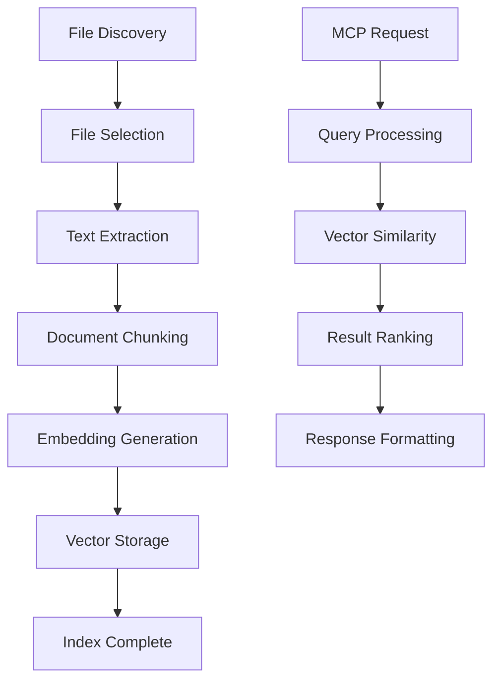
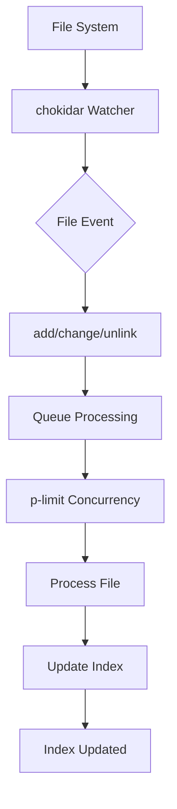

# Architecture Overview

This document describes the system architecture, design patterns, and component interactions of the Local Search MCP Server.

## 🏗️ System Architecture

```
┌─────────────────────────────────────────────────────────────────────────────────┐
│                      LOCAL SEARCH MCP SERVER - EVENT LOOP ARCHITECTURE         │
│                                                                                │
│  ┌─────────────────┐  ┌─────────────────┐  ┌─────────────────┐  ┌─────────────┐ │
│  │   MCP Layer     │  │   Service       │  │   Persistence   │  │   External   │ │
│  │                 │  │   Orchestration │  │   Layer         │  │   Services   │ │
│  │  ┌────────────┐ │  │  ┌────────────┐ │  │  ┌────────────┐ │  │  ┌─────────┐ │ │
│  │  │ MCP Server │ │  │  │ Search     │ │  │  │ Vector     │ │  │  │ GitHub   │ │ │
│  │  │ Interface  │◄►│  │  │ Service   │◄►│  │  │ Index     │◄┼─┼►│   Repos  │ │ │
│  │  └────────────┘ │  │  └────────────┘ │  │  └────────────┘ │  │  └─────────┘ │ │
│  │                 │  │  ┌────────────┐ │  │                │  │  ┌─────────┐ │ │
│  │  • Tool Schema  │  │  │ Repo       │ │  │  • SQLite     │  │  │ File     │ │ │
│  │  • Request/Resp │  │  │ Service    │◄►│  │  • Embeddings│  │  │ URLs     │ │ │
│  │  • Error Handling│  │  └────────────┘ │  │  • Chunks     │  │  └─────────┘ │ │
│  └─────────────────┘  │  ┌────────────┐ │  └────────────────┘  └─────────────┘ │
│                       │  │ File        │ │                                       │
│                       │  │ Download    │ │                                       │
│                       │  │ Service     │◄┼───────────────────────────────────────┘
│                       │  └────────────┘ │
│                       └─────────────────┘                                       │
│                                                                                │
│  ┌─────────────────────────────────────────────────────────────────────────────┐ │
│  │                      EVENT LOOP PROCESSING ENGINE                           │ │
│  │                                                                            │ │
│  │  ┌─────────────┐  ┌─────────────┐  ┌─────────────┐  ┌─────────────┐         │ │
│  │  │ File        │  │ Text        │  │ Embedding   │  │ Vector       │         │ │
│  │  │ Processor   │─►│ Chunker     │─►│ Service     │─►│ Storage      │         │ │
│  │  │ (Async I/O) │  │ (Yielding)  │  │ (Batched)   │  │ (ACID)       │         │ │
│  └─────────────┘  └─────────────┘  └─────────────┘  └─────────────┘         │ │
│        │                EVENT LOOP      EVENT LOOP      TRANSACTION            │ │
│   Text Extract  Yielding  Tokenize  Batched Yield  Similarity  Storage         │ │
│      .txt,.md    Every 1K     & Clean   Every 10      Search    Operations       │ │
│     .json,.js   Chunks        Process  Batches       Engine    (CRUD)           │ │
│                                                                                │
│  ┌─────────────────────────────────────────────────────────────────────────────┐ │
│  │                          CONCURRENCY MODEL                                  │ │
│  │                                                                            │ │
│  │  • NO THREADING - Simple async functions with setImmediate() yielding     │ │
│  │  • MULTIPLE JOBS - Concurrent background processing                         │ │
│  │  • MCP RESPONSIVE - Never blocks main thread despite long operations       │ │
│  └─────────────────────────────────────────────────────────────────────────────┘ │
│                                                                                │
└─────────────────────────────────────────────────────────────────────────────────┘
```

## 📊 Component Overview

### 🎯 MCP Layer (Protocol Interface)

**Purpose**: Handle MCP protocol communication and tool exposition

| Component | Responsibility | Key Features |
|-----------|----------------|--------------|
| **MCP Server** | - Tool registration and schema management<br>- Request/response routing<br>- Error formatting and handling<br>- Stdio protocol compliance | - Type-safe tool definitions<br>- Request validation<br>- Graceful error recovery |
| **Tool Handlers** | - Parameter validation and transformation<br>- Service method orchestration<br>- Response formatting | - Input sanitization<br>- Result aggregation<br>- Progress indication |

### ⚙️ Service Orchestration Layer

**Purpose**: Coordinate complex operations across multiple subsystems

| Component | Responsibility | Key Features |
|-----------|----------------|--------------|
| **SearchService** | - Primary API for indexing/searching<br>- Pipeline orchestration<br>- Result ranking and filtering<br>- Error aggregation | - Parallel processing with p-limit<br>- Memory-efficient batching<br>- Comprehensive error handling |
| **BackgroundProcessor** | - Asynchronous file processing<br>- Repository downloading via repomix<br>- HTTP file downloads with progress<br>- Event loop yielding for MCP responsiveness | - setImmediate() yielding<br>- Batch embedding processing<br>- Job progress tracking |

### 💾 Persistence Layer

**Purpose**: Store and retrieve vector embeddings and document metadata

| Component | Responsibility | Key Features |
|-----------|----------------|--------------|
| **VectorIndex** | - Vector storage and retrieval<br>- Similarity search algorithms<br>- Database management | - SQLite optimization<br>- Cosine similarity<br>- Metadata tracking<br>- Index versioning |

### 🚀 Core Processing Engine

**Purpose**: Execute the document processing pipeline with performance optimization

| Component | Responsibility | Key Features |
|-----------|----------------|--------------|
| **FileProcessor** | - Multi-format text extraction<br>- Character encoding handling<br>- Size validation | - 8 file types supported<br>- Content sanitization<br>- Memory limits |
| **TextChunker** | - Intelligent document segmentation<br>- Overlap management<br>- Content preservation | - Event loop yielding<br>- Configurable chunk sizes<br>- Token counting |
| **EmbeddingService** | - Vector generation using transformers<br>- GPU acceleration<br>- Batch processing | - Single model instance<br>- Memory optimization<br>- Error recovery |
| **ProgressManager** | - Job progress tracking<br>- Callback registration<br>- Event loop yielding | - Real-time progress updates<br>- setImmediate() yielding<br>- Background coordination |

### 🎯 Job Management Layer

**Purpose**: Handle background processing jobs and progress reporting

| Component | Responsibility | Key Features |
|-----------|----------------|--------------|
| **JobManager** | - Job lifecycle management<br>- Status tracking<br>- Result storage | - In-memory job storage<br>- Progress callbacks<br>- Error aggregation |

## 🔄 Data Flow Architecture

### Document Processing Pipeline



### Detailed Processing Flow

#### 1. Content Ingestion Phase

```
┌─────────────────┐    ┌─────────────────┐    ┌─────────────────┐
│   File System   │───▶│   File Scan     │───▶│   File Filter   │
│   Discovery     │    │   (Recursive)   │    │   (Patterns)    │
└─────────────────┘    └─────────────────┘    └─────────────────┘
                             │                        │
                             ▼                        ▼
```

#### 2. Content Processing Phase

```
┌─────────────────┐    ┌─────────────────┐    ┌─────────────────┐
│   File Reader   │───▶│   Text Extract  │───▶│   Content       │
│   (Buffered)    │    │   (Format-aware)│    │   Validator     │
└─────────────────┘    └─────────────────┘    └─────────────────┘
                             │                        │
                             ▼                        ▼
```

#### 3. Chunking and Embedding Phase

```
┌─────────────────┐    ┌─────────────────┐    ┌─────────────────┐
│   Text Chunker  │───▶│   Token Counter │───▶│   Embedding     │
│   (Semantic)    │    │   (Statistics)  │    │   Generator     │
└─────────────────┘    └─────────────────┘    └─────────────────┘
                             │                        │
                             ▼                        ▼
```

#### 4. Storage and Search Phase

```
┌─────────────────┐    ┌─────────────────┐    ┌─────────────────┐
│   Vector Index  │───▶│   Similarity    │───▶│   Result Rank   │
│   (SQLite)      │    │   Search        │    │   & Filter      │
└─────────────────┘    └─────────────────┘    └─────────────────┘
                             │                        │
                             ▼                        ▼
```

### File Watcher Integration



## 🏛️ Design Principles

### **Separation of Concerns**
- Each service handles exactly one responsibility
- Clean interfaces between layers
- No business logic in protocol layer

### **Performance Optimization**
- Parallel processing with concurrency limits
- Memory-efficient streaming operations
- Lazy initialization and resource pooling
- Optimized database queries with proper indexing

### **Error Resilience**
- Comprehensive error handling at each layer
- Graceful degradation for partial failures
- Detailed error logging and debugging
- Recovery mechanisms for transient failures

### **Scalability Architecture**
- Stateless service design
- Horizontal scaling potential
- Resource usage monitoring
- Configuration-driven performance tuning

## 🔧 Key Technical Decisions

### **Embedding Model Selection**
- **Choice**: `@xenova/transformers` (JavaScript-native)
- **Rationale**:
  - No Python dependency
  - Client-side compatible
  - Smaller footprint than full PyTorch models
  - GPU acceleration support

### **Database Choice**
- **Choice**: SQLite with better-sqlite3
- **Rationale**:
  - Single-file database
  - ACID transactions
  - Excellent performance for read-heavy workloads
  - No additional services required

### **Concurrency Strategy**
- **Choice**: p-limit for controlled parallelism
- **Rationale**:
  - Prevents resource exhaustion
  - Configurable per operation type
  - Backpressure handling
  - Memory usage control

### **File Watching**
- **Choice**: chokidar with custom patterns
- **Rationale**:
  - Cross-platform filesystem events
  - Configurable ignore patterns
  - Event debouncing
  - Memory-efficient filtering

## 📈 Performance Characteristics

### **Scalability Metrics**

| Component | Scaling Factor | Bottleneck | Optimization Strategy |
|-----------|----------------|------------|----------------------|
| **File Processing** | Linear w/ CPU cores | CPU embedding | p-limit concurrency |
| **Directory Scanning** | Quadratic w/ depth | I/O operations | Parallel traversal |
| **Vector Search** | Logarithmic w/ docs | Memory → Storage | SQLite indexes |
| **Storage Operations** | Linear w/ writes | Disk I/O | Transaction batching |

### **Memory Usage Patterns**

```
Low Load (100 docs):
├── Embedding models: ~500MB
├── Document cache: ~50MB
├── Working memory: ~100MB
└── Total: ~650MB

High Load (10K docs):
├── Embedding models: ~500MB
├── Document cache: ~500MB
├── Working memory: ~200MB
└── Total: ~1.2GB
```

### **CPU Utilization**

- **Single file processing**: ~5-10% CPU per file
- **Batch processing**: Scales linearly with concurrency
- **Search operations**: <1% CPU per query
- **Background monitoring**: <1% continuous CPU

## 🔄 Asynchronous Patterns

### **Promise-based Processing**
- All I/O operations are async
- Proper error propagation through chains
- Cancellation support via AbortController

### **Streaming Operations**
```typescript
// Large file processing with memory limits
const stream = fs.createReadStream(filePath, { highWaterMark: 64 * 1024 });
stream.pipe(transformer).pipe(output);
```

### **Batch Processing**
```typescript
// Embedding generation with batching
const batches = chunkArray(embeddings, batchSize);
for (const batch of batches) {
  const vectors = await model.generate(batch);
  await index.store(vectors);
}
```

## 🛠️ Extensibility Architecture

### **Plugin System Design**
- Interface-based component registration
- Configurable processing pipelines
- Hot-swappable implementations

### **Configuration Driven**
- Runtime parameter adjustment
- Environment variable support
- Profile-based optimization

### **API Compatibility**
- Versioned interfaces
- Backward compatibility preservation
- Migration path support

## 🧪 Testing Architecture

### **Unit Testing Context**
- Isolated component testing
- Mock external dependencies
- Performance regression monitoring

### **Integration Testing**
- End-to-end pipeline validation
- Performance benchmarking
- Resource usage monitoring

### **File Format Testing**
- Comprehensive format coverage
- Edge case handling
- Performance validation

---

See [Performance Guide](../performance/) for optimization details and [Usage Guide](../usage/) for integration patterns.
