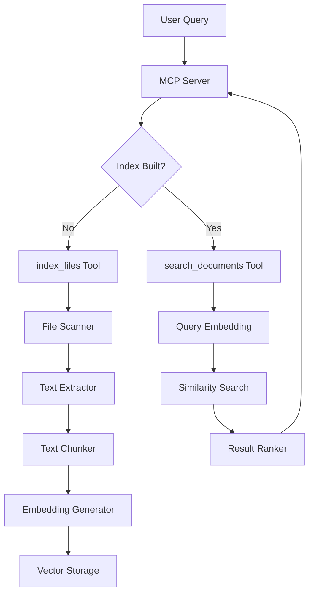

# Architecture Overview

## System Components

### 1. File Processor
- **Responsibility**: Extract text from various file formats
- **Input**: File paths
- **Output**: Raw text content
- **Dependencies**: File system access, format parsers

### 2. Text Chunker
- **Responsibility**: Divide documents into semantically cohesive chunks
- **Strategies**: 
  - Fixed-size with overlap
  - Sentence-based splitting
  - Paragraph awareness
- **Configuration**: Chunk size, overlap percentage

### 3. Embedding Service
- **Responsibility**: Convert text chunks to vector representations
- **Engine**: @xenova/transformers
- **Features**: 
  - GPU acceleration support
  - Multiple model options
  - Batch processing for efficiency

### 4. Vector Index
- **Responsibility**: Store and search vector embeddings
- **Implementation**: In-memory array with cosine similarity
- **Future**: Support for external databases (Pinecone, Weaviate)

### 5. Search Engine
- **Responsibility**: Handle query processing and result ranking
- **Features**:
  - Natural language query support
  - Relevance scoring
  - Pagination and filtering

### 6. MCP Interface
- **Responsibility**: Expose functionality as MCP tools and resources
- **Capabilities**: Tools for indexing, searching, configuration
- **Transport**: Stdio for MCP protocol compliance

## Data Flow



## Class Diagram

```
MCP Server
├── FileProcessor
├── TextChunker
├── EmbeddingService
├── VectorIndex
├── SearchService
└── MCP Tools
    ├── index_files
    ├── search_documents
    ├── get_file_details
    └── update_index
```

## Performance Considerations

### Memory Management
- Chunk streaming for large documents
- Lazy loading of embeddings
- Garbage collection monitoring

### GPU Optimization
- Batch processing of embeddings
- Model caching
- Fallback to CPU if GPU unavailable

### Caching Strategy
- Index persistence to disk
- Updated file tracking
- Query result caching
- LRU cache for frequent queries

## Extensibility

### Plugin Architecture
- File format parsers as plugins
- Chunking strategies as modules
- Embedding model providers
- Storage backend options

### Configuration
- JSON-based config files
- Environment variable support
- Runtime parameter adjustment

## Error Handling

### Graceful Degradation
- CPU fallback for GPU operations
- Partial indexing for failed files
- Warning logs vs errors

### Recovery Mechanisms
- Index rebuild on corruption
- Automatic retry for transient failures
- Progressive indexing for interrupted operations
